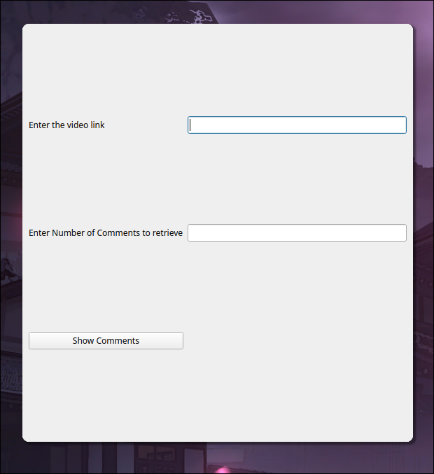
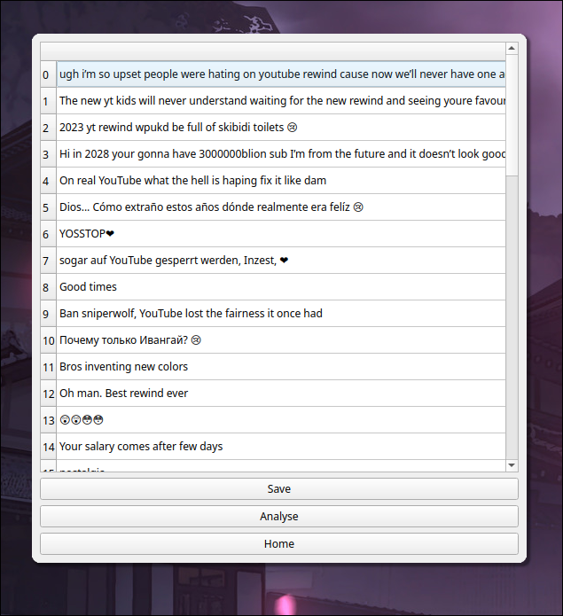
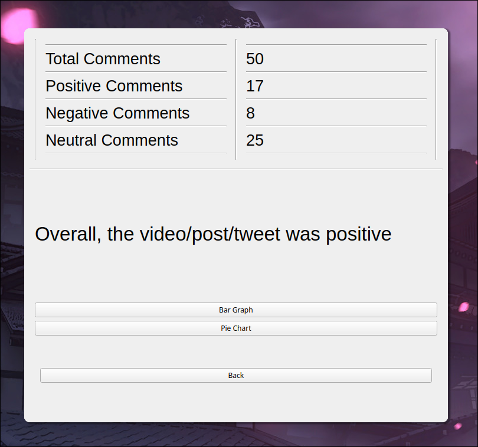
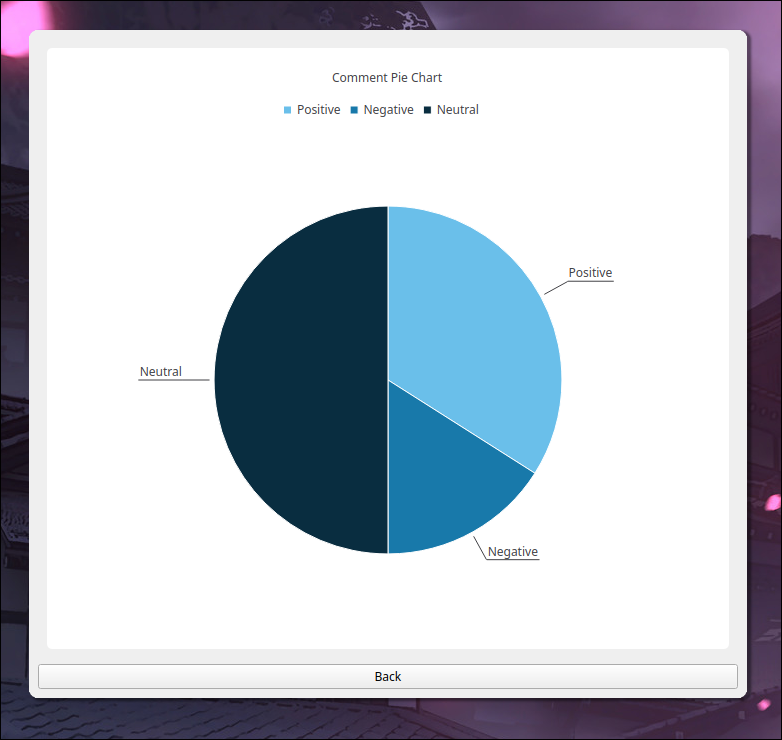

# Comment-Analysis (PyQt and NLTK)

### Building
`git clone https:/github.com/zls17/Comment-Analysis.git`\
`$ pip install -r requirements.txt`
`python3 main.py`

### Usage

#### For Youtube
- Enter the URL of the video in the URL Field.
- Enter the number of comments to be retrieved.
- Click on Analyse.
>
> 
>
> 
>
> 
>
> 
#### For Twitter
- Enter Username or twitter hashtag (eg. #news).
- Enter the number of tweets to be retrieved.
- Click Analyse

#### For Reddit
- Enter the Reddit post URL in the URLfield.
- Enter the number of comments to be retrieved.
- Click on Analyse

#### Update
* A third party api was used to scrape tweets, due to some changes made by Twitter, the twitter part of the application may not work.
* Reddit also made some changes with their API, the code hasn't been updated since then, so reddit part of the application may not work.
  
